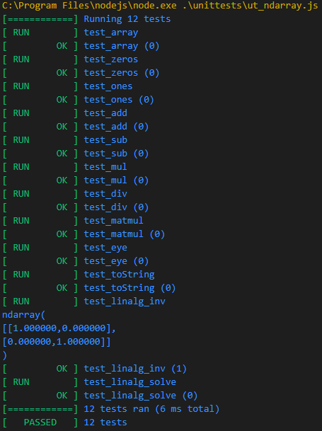

# htest.js
Javascript version of [htest](https://github.com/trip2eee/htest).

It mimics interfaces of google test and python unittest frameworks for easy use.



## Assertions
This unit test framework provides assertions in pairs: expect*() and assert*() as googletest does.

assert*() returns the test immediately without performing further test. On the other hand expect*() does not return and executes following test codes.

|Name                       | Description                    |
|---------------------------|--------------------------------|
| this.expectEqual(x, y)    | Test if x and y are equal.     |
| this.expectNotEqual(x, y) | Test if x and y are not equal. |
| this.expectNear(x, y, eps)| Test if (x-y) < eps.           |
| this.expectTrue(x)        | Test if x is true.             |
| this.expectFalse(x)       | Test if x is false.            |

## Usage

1. Declare a unit test class inheriting htest class.
2. If necessary, override SetUp() method to prepare objects for each test.
3. If necessary, override TearDown() method to release resources allocated in SetUp().
4. If needed, define subroutines for your tests to share.
5. Write test bodies as methods of the unit test class. The name of test case shall start with 'test_' to distinguish test cases from subroutines.
6. Create test class instance and call test() method.


```JS
var ut = require('../htest.js/htest');

class ut_numjs extends ut.htest
{
    SetUp(){
        // Initialization code here.
    }
    
    TearDown(){
        // Release code here.
    }

    test_array(){
        // Test body.
    }

    test_zeros(){
        // Test body.
    }

    test_ones(){
        // Test body.
    }
};

// run tests.
let test = new ut_numjs();
test.test();
```

